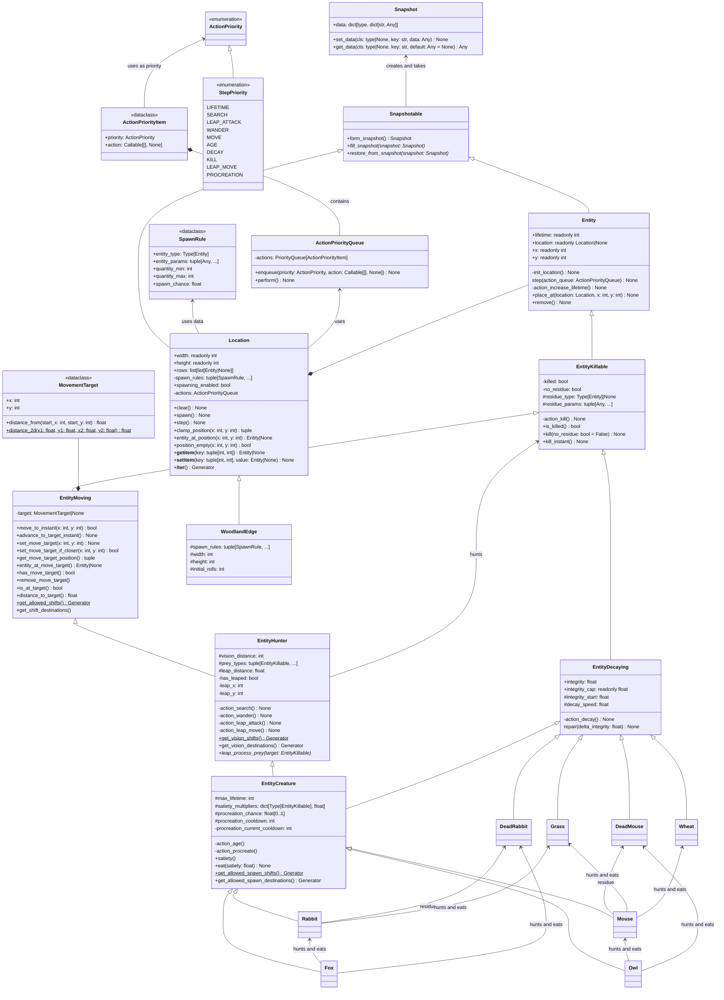

```mermaid
classDiagram

	direction BT
	
	class ActionPriorityQueue {
		-actions: PriorityQueue[ActionPriorityItem]
		+enqueue(priority: ActionPriority, action: Callable[[], None]) None
		+perform() None
	}
	
	
	class ActionPriority {
	}
	<<enumeration>> ActionPriority
	
	
	class ActionPriorityItem {
    	+priority: ActionPriority
    	+action: Callable[[], None]
    }
    <<dataclass>> ActionPriorityItem
    ActionPriorityItem --> ActionPriority: uses as priority
	ActionPriorityQueue --* ActionPriorityItem: contains
	
	
	class StepPriority {
		LIFETIME
		SEARCH
		LEAP_ATTACK
		WANDER
		MOVE
		AGE
		DECAY
		KILL
		LEAP_MOVE
		PROCREATION
	}
	<<enumeration>> StepPriority
	StepPriority --|> ActionPriority
	
	
	
	
	
	class Snapshotable:::abstract {
		+form_snapshot() Snapshot
		+fill_snapshot(snapshot: Snapshot)*
		+restore_from_snapshot(snapshot: Snapshot)*
	}
	
	class Snapshot {
		+data: dict[type, dict[str, Any]]
		+set_data(cls: type|None, key: str, data: Any) None
		+get_data(cls: type|None, key: str, default: Any = None) Any
	}
	Snapshotable --> Snapshot: creates and takes


    class Location:::abstract {
    	+width: readonly int
    	+height: readonly int
    	+rows: list[list[Entity|None]]
    	-spawn_rules: tuple[SpawnRule, ...]
    	+spawning_enabled: bool
    	-actions: ActionPriorityQueue
    	
    	+clear() None
    	+spawn() None
    	+step() None
    	
    	+clamp_position(x: int, y: int) tuple
    	+entity_at_position(x: int, y: int) Entity|None
    	+position_empty(x: int, y: int) bool
    	+__getitem__(key: tuple[int, int]) Entity|None
		+__setitem__(key: tuple[int, int], value: Entity|None) None
    	+__iter__() Generator
    }
    Location --|> Snapshotable
	
	class SpawnRule {
		+entity_type: Type[Entity]
		+entity_params: tuple[Any, ...]
		+quantity_min: int
		+quantity_max: int
		+spawn_chance: float
	}
	<<dataclass>> SpawnRule
	Location --> SpawnRule: uses data
	Location --> ActionPriorityQueue: uses


    class Entity:::abstract {
    	+lifetime: readonly int
    	+location: readonly Location|None
    	+x: readonly int
    	+y: readonly int
    	
    	-init_location() None
    	step(action_queue: ActionPriorityQueue) None
    	-action_increase_lifetime() None
    	+place_at(location: Location, x: int, y: int) None
    	+remove() None
    }
    Entity --|> Snapshotable
    Location *-- Entity
    
    
    class EntityKillable:::abstract {
    	-killed: bool
    	-no_residue: bool
    	#residue_type: Type[Entity]|None
    	#residue_params: tuple[Any, ...]
    	-action_kill() None
    	+is_killed() bool
    	+kill(no_residue: bool = False) None
    	+kill_instant() None
	}
	EntityKillable --|> Entity
	
	
	class EntityDecaying:::abstract {
		+integrity: float
		+integrity_cap: readonly float
		#integrity_start: float
		#decay_speed: float
		-action_decay() None
		repair(delta_integrity: float) None
	}
	EntityDecaying --|> EntityKillable
	
	
	class EntityMoving:::abstract {
		-target: MovementTarget|None
		+move_to_instant(x: int, y: int) bool
		+advance_to_target_instant() None
		+set_move_target(x: int, y: int) None
		+set_move_target_if_closer(x: int, y: int) bool
		+get_move_target_position() tuple
		+entity_at_move_target() Entity|None
		+has_move_target() bool
		+remove_move_target()
		+is_at_target() bool
		+distance_to_target() float
		+get_allowed_shifts()$ Generator
        +get_shift_destinations()
	}
	EntityMoving --|> EntityKillable
	
	
	class MovementTarget {
		+x: int
		+y: int
		+distance_from(start_x: int, start_y: int) float
		+distance_2d(x1: float, y1: float, x2: float, y2: float)$ float
	}
	<<dataclass>> MovementTarget
	EntityMoving *-- MovementTarget
	
	
	class EntityHunter:::abstract {
		#vision_distance: int
		#prey_types: tuple[EntityKillable, ...] 
		#leap_distance: float
		-has_leaped: bool
		-leap_x: int
		-leap_y: int
		
		-action_search() None
		-action_wander() None
		-action_leap_attack() None
		-action_leap_move() None
		+get_vision_shifts()$ Generator
		+get_vision_destinations() Generator
		+leap_process_prey(target: EntityKillable)*
	}
	EntityHunter --|> EntityMoving
	EntityHunter --> EntityKillable: hunts
	
	
	class EntityCreature:::abstract {
		#max_lifetime: int
		#satiety_multipliers: dict[Type[EntityKillable], float]
		#procreation_chance: float[0..1]
		#procreation_cooldown: int
		-procreation_current_cooldown: int
		-action_age()
		-action_procreate()
		+satiety()
		+eat(satiety: float) None
		+get_allowed_spawn_shifts()$ Gnerator
		+get_allowed_spawn_destinations() Generator
	}
    EntityCreature --|> EntityHunter
    EntityCreature --|> EntityDecaying
    
    
    
    
  	
  	
  	class WoodlandEdge {
  		#spawn_rules: tuple[SpawnRule, ...]
  		#width: int
  		#height: int
  		#initial_rolls: int
  	}
	WoodlandEdge --|> Location
	
	
	class Grass {
	}
	Grass --|> EntityDecaying
	
	class Wheat {
	}
	Wheat --|> EntityDecaying
	
	
	class DeadRabbit {
	}
	DeadRabbit --|> EntityDecaying
	
	class DeadMouse {
	} 
	DeadMouse --|> EntityDecaying
	
	
	class Rabbit {
	}
	Rabbit --|> EntityCreature
	Rabbit --> DeadRabbit: residue
	Rabbit --> Grass: hunts and eats
	
	class Mouse {
	}
	Mouse --|> EntityCreature
	Mouse --> DeadMouse: residue
	Mouse --> Grass: hunts and eats
	Mouse --> Wheat: hunts and eats
	
	
	class Fox {
	}
	Fox --|> EntityCreature
	Fox --> Rabbit: hunts and eats
	Fox --> DeadRabbit: hunts and eats
	
	class Owl {
	}
	Owl --|> EntityCreature
	Owl --> Mouse: hunts and eats
	Owl --> DeadMouse: hunts and eats
```