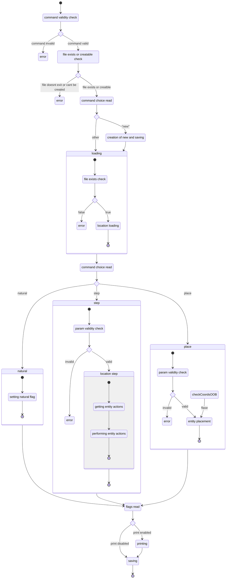

```mermaid
stateDiagram-v2

	%% command validity
	state "command validity check" as commandValidity
	state commandValidiyResult <<choice>>
	[*] --> commandValidity
	commandValidity --> commandValidiyResult
	
	state "error" as commandError
	commandValidiyResult --> commandError : command invalid
	commandValidiyResult --> fileExistsOrCreatable : command valid
	
	%% file check
	state "file exists or creatable check" as fileExistsOrCreatable
	state fileExistsOrCreatableResult <<choice>>
	fileExistsOrCreatable --> fileExistsOrCreatableResult
	
	state "error" as invalidFileError
	fileExistsOrCreatableResult --> invalidFileError : file doesnt exit or cant be created
	fileExistsOrCreatableResult --> commandChoiceRead1 : file exists or creatble
	
	%% new
	state "command choice read" as commandChoiceRead1
	state commandChoiceRead1Result <<choice>>
	commandChoiceRead1 --> commandChoiceRead1Result
	
	commandChoiceRead1Result --> load : other
	
	state "creation of new and saving" as createNew
	commandChoiceRead1Result --> createNew : "new"
	createNew --> load


	%% load
	
	state "loading" as load
	state load {
		
		state "file exists check" as loadFileExists
		state loadFileExistsResult <<choice>>
		[*] --> loadFileExists
		loadFileExists --> loadFileExistsResult
	
		state "location loading" as loadLocation
		state "error" as loadError
		loadFileExistsResult --> loadError : false
		loadFileExistsResult --> loadLocation : true
		loadLocation --> [*]
	}
	load --> subcommand
	
	%% subcommand
	state "command choice read" as subcommand
	state subcommandResult <<choice>>
	subcommand --> subcommandResult		
		
	%% natural
	subcommandResult --> subcommandNatural : natural
	state "natural" as subcommandNatural
	state subcommandNatural {
		state "setting natural flag" as setNaturalFlag
		[*] --> setNaturalFlag
		setNaturalFlag --> [*]
	}
	subcommandNatural --> flagsRead
	
	%% step
	subcommandResult --> subcommandStep : step
	state "step" as subcommandStep
	state subcommandStep {
	
		state "param validity check" as stepParamValidiyCheck
		state stepParamValidiyCheckResult <<choice>>
		[*] --> stepParamValidiyCheck
		stepParamValidiyCheck --> stepParamValidiyCheckResult
		
		state "error" as stepParamError
		stepParamValidiyCheckResult --> stepParamError : invalid
        stepParamValidiyCheckResult --> locationStep : valid
        
		state "location step" as locationStep
		state locationStep {
			state "getting entity actions" as getActions
			state "performing entity actions" as performActions
			
			[*] --> getActions
			getActions --> performActions
			performActions --> [*]
		}
		locationStep --> [*]
	}
	subcommandStep --> flagsRead
	
	%% place
	subcommandResult --> subcommandPlace : place
	state "place" as subcommandPlace
	state subcommandPlace {
	
		state "param validity check" as placeParamValidiyCheck
		state placeParamValidiyCheckResult <<choice>>
		[*] --> placeParamValidiyCheck
		placeParamValidiyCheck --> placeParamValidiyCheckResult
		
		state "error" as placeParamError
		placeParamValidiyCheckResult --> placeParamError : invalid
		placeParamValidiyCheckResult --> placeEntity : valid
			
		state "entity placement" as placeEntity
			checkCoordsOOB --> placeEntity : flase
			placeEntity --> [*]
	}
	subcommandPlace --> flagsRead
		
	%% print
	state "flags read" as flagsRead
	state flagsReadResult <<choice>>
	flagsRead --> flagsReadResult
	
	state "printing" as print
	state "saving" as save
	flagsReadResult --> save : print disabled
	flagsReadResult --> print : print enabled
	
	print --> save
	
	save --> [*]
	
	
```

